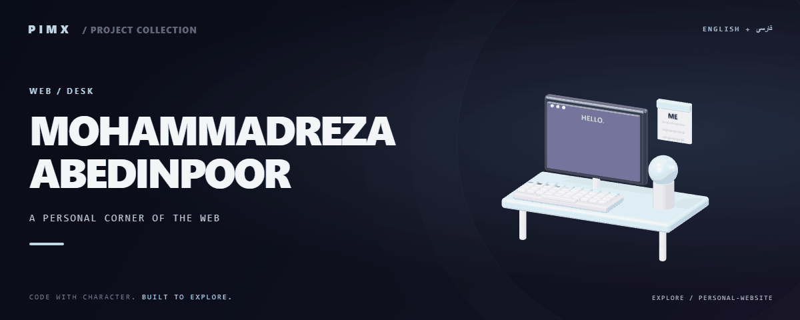

<div align="center">



**[English](README.md) · [فارسی](README.fa.md)**


</div>

# MOHAMMADREZA ABEDINPOOR

وب‌سایت شخصی استاتیک با بخش پروژه‌ها، فایل گواهی‌ها، داده زبان‌ها، فراداده موتور جست‌وجو و Service Worker.

[GitHub](https://github.com/MOHAMMADREZAABEDINPOOR/personal-website) · [PIMX / Profile](https://github.com/MOHAMMADREZAABEDINPOOR) · [بنر ثابت](assets/readme/hero.png)

## امکانات

- معرفی شخصی و نمایش پروژه‌ها
- فایل گواهی و منابع زبان
- Manifest، Service Worker و پایه نصب سایت
- نقشه سایت، robots و راهنمای استقرار و سئو

## پشته فنی

| ابزار | نسخه یا منبع |
|---|---|
| HTML / CSS / JavaScript | `static files` |

## شروع کار

مرورگر جدید؛ Python فقط برای سرور HTTP محلی اختیاری است.

```bash
git clone https://github.com/MOHAMMADREZAABEDINPOOR/personal-website.git
cd personal-website

python -m http.server 8000
```

## تنظیمات

فایل محیط استاندارد تعریف نشده است. برای تمرین‌های مستقل تنظیم خارجی لازم نیست؛ اگر در کد ثابت‌های سرویس یا مسیر وجود دارد، آن‌ها را پیش از اجرا بررسی کنید.

## استفاده

پوشه را با HTTP سرو و index.html را باز کنید. پس از تغییر محتوا فایل زبان، لینک شخصی و نقشه سایت را به‌روز کنید.

## ساختار پروژه

| مسیر | نقش |
|---|---|
| [`assets/`](assets/) | فایل برند، رسانه و README |
| [`google-site-verification.html`](google-site-verification.html) | فایل ورودی یا تنظیم پروژه |
| [`index.html`](index.html) | فایل ورودی یا تنظیم پروژه |
| [`manifest.json`](manifest.json) | فایل ورودی یا تنظیم پروژه |

## فرمان‌ها و بررسی

فرمان آزمون خودکار در manifest تعریف نشده است. اجرای محلی و بررسی رفتار نمونه را انجام دهید.

## استقرار

پوشه را روی میزبان استاتیک دارای HTTPS منتشر کنید؛ مسیر فایل و لینک‌های بیرونی را بررسی کنید.

## محدودیت‌ها

کش Service Worker ممکن است فایل قدیمی را نگه دارد؛ هنگام توسعه داده سایت را پاک کنید. حقوق گواهی و فایل‌های برند متعلق به صاحبانشان است.

## رفع مشکل

- پکیج غایب: وابستگی را با مدیر پکیج پروژه نصب کنید.
- خطای API یا شبکه: آدرس، سرویس و اتصال میزبانی را بررسی کنید.
- فایل قدیمی: در صورت وجود اسکریپت ساخت، build و کش مرورگر را تازه کنید.

## مشارکت

برای تغییر، شاخه مستقل بسازید، رفتار فعلی را بررسی کنید و توضیح روشن همراه تغییر بفرستید. اطلاعات خصوصی، خروجی build و دیتابیس محلی را commit نکنید.

راهنماهای همراه:

- [DEPLOYMENT.md](DEPLOYMENT.md)

## مجوز

متن مجوز در فایل زیر است؛ حقوق منابع و وابستگی‌های شخص ثالث ممکن است متفاوت باشد: [LICENSE](LICENSE).

---

ساخته‌شده در مجموعه **PIMX** · مستندات فارسی و انگلیسی.
